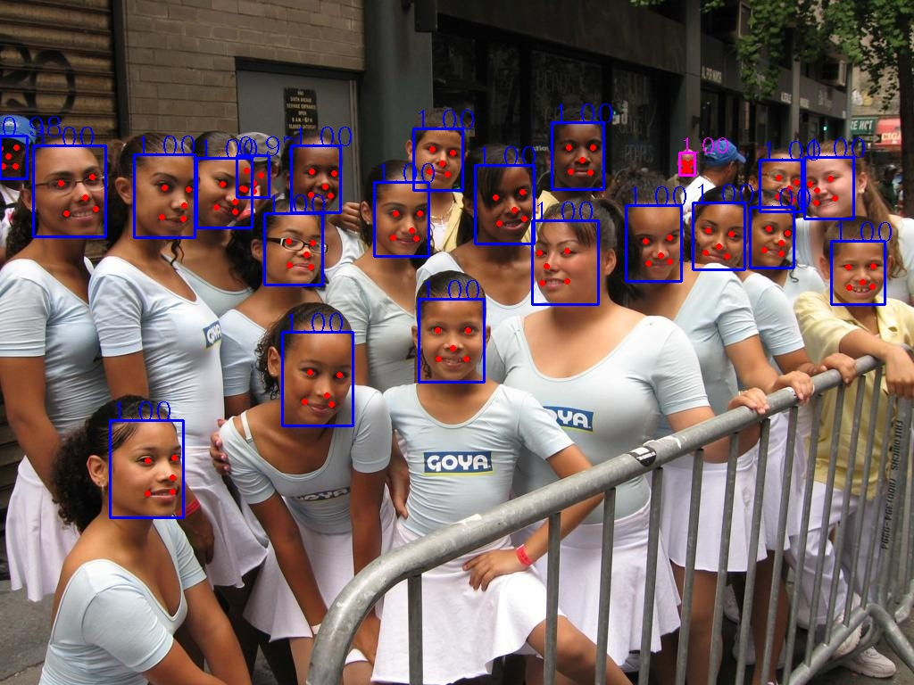
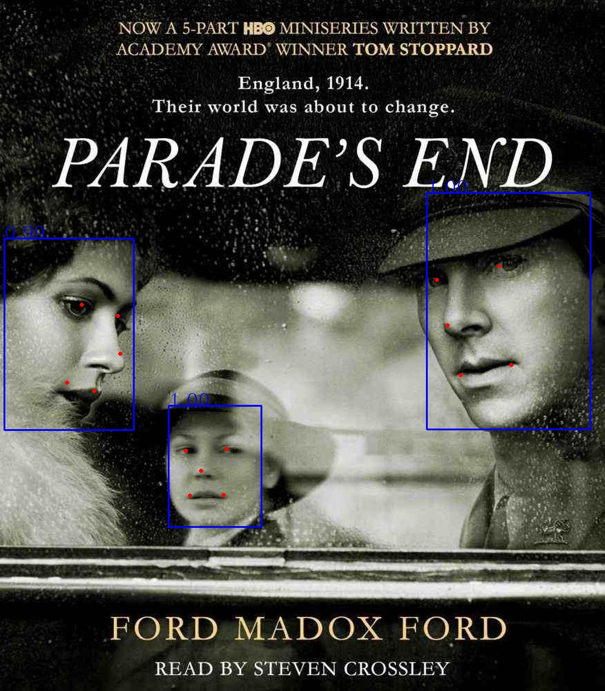

# RetinaFace.PyTorch
> Reimplentment of RetinaFace with modification!

## Requirements
- pytorch
- tvm

## WIDER accuracy
| Impelmentation  | Easy-Set | Medium-Set | Hard-Set | Speed    |Test-Method(short side 1600) |Params |FLOPs (640*640)|
| --------------- | -------- | ---------- | -------- | -------- | --------     | ----- |-----     |
|     res18       | -        | -          | -        | -        | single-scale |-      |          |
|modified_mnasnet | 0.8495   | 0.8339     | 0.7531   | -        | single-scale |325.38k|386.57MMac|
|modified_mnasnet | 0.8649   | 0.8436     | 0.7139   |          | single-scale |325.38k|386.57MMac|
|mobilenet0.25    | -        | -          | -        | -        | single-scale |427.22k|  1.02G   |

> Note: I test the forward speed with converted tvm model using mac i7 cpu.

## AFLW accuracy

## demo:

## TODO: 
- [ ] Wider Face accuracy testing
- [ ] AFLW accuracy testing
- [ ] Inference on TVM